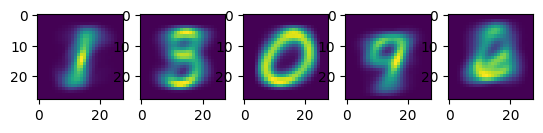
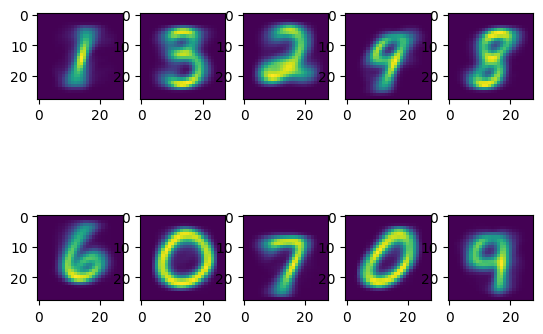

# K-Means Clustering

Implementation of the K-Means clustering algorithm and applied to the MNIST dataset.

## Background

The data is the classic **MNIST** database of handwritten digits
([LeCun, Bottou, Bengio & Haffner, *Proc. IEEE* 1998](http://yann.lecun.com/exdb/mnist/)),
a standard benchmark of scanned digit images collected from US Census Bureau
employees and high-school students.

Each image is a 28 × 28 grayscale bitmap with pixel intensities in `[0, 255]`.
Images are flattened into vectors $x_i \in \mathbb{R}^{784}$ and scaled to
`[0, 1]`, so every sample is a single point in a 784-dimensional space and
Euclidean distance between two points measures raw pixel-wise dissimilarity.
The images live in data/mnist.npz.

The task is unsupervised clustering: the digit labels are **never** shown to
the algorithm. Instead of learning a decision boundary from labelled examples,
K-Means partitions all the image data points into $K$ groups by alternating between
assigning each point to its nearest centroid and recomputing each centroid as
the mean of the points assigned to it. The labels are held out and used only
*after* fitting, to measure how well the discovered clusters line up with the
true digit labels.

## Model

Each cluster $k$ is represented by a centroid $c_k \in \mathbb{R}^M$ (row $k$ of
$C$), and each point $x_i$ is assigned to exactly one cluster via the label
$z_i \in \{0, \dots, K-1\}$. The objective is the within-cluster sum of squared
Euclidean distances between every point and the centroid it belongs to:

$$
J(C, z) = \Sigma_{i=1}^{N} \| x_i − c_{z_i} \|_2^2
$$

**Optimization** is performed with the standard K-means algorithm, which alternates between
two steps that each decrease $J$ and never increase it. The assignment step
holds the centroids fixed and assigns every point to its nearest one; the update
step holds the assignments fixed and moves every centroid to the mean of its
members:
$$
z_i = argmin_k \| x_i − c_k \|_2^2 \\
c_k = mean{x_i:z_i = k}
$$
**Convergence** is exact: the loop runs until the assignment vector $z$ is identical to that of the previous iteration. Since the number of possible partitions is finite and $J$ strictly decreases whenever an assignment changes, this always terminates at a local minimum, not necessarily the global one.

## Results

The loss necessarily decreases throughout training rounds, because the update and assignment step cause the loss function $J$ to strictly decrease. The clustering algorithm was applied to the mnist dataset, clustering the images into different number of clusters (see figures below for examples). We can see that at K=10, almost all digits are reconstructed as distinct cluster centers, with the exception of zero appearing twice, and the digit four missing.

**The resulting K=5 clusters visualized after K-means clustering of the MNIST dataset**
<p align="center">
  
</p>

**The resulting K=10 clusters visualized after K-means clustering of the MNIST dataset**
<p align="center">
  
</p>


## Installation

```bash
git clone https://github.com/kierancarroll/K-means-clustering-MNIST.git
cd K-means-clustering-MNIST
```

## Usage

```bash
python3 visualization.py
```